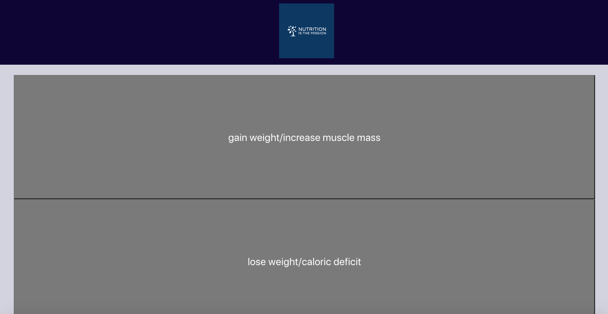

# nutrition-is-the-mission

## Description

The nutrition is the mission application was created to be approachable for all types or users. When the webpage is loaded the user is asked what their nutritional goals are, to lose weight or to gain muscle. When the user clicks on their nutritional goal they are taken to a screen where they can input their body measuments and their name, if they they would like to. When they enter their weight in kg, height in cm, age, and name, the user is then presented with their bmi results based on their input. The results will be saved in local storage, and the user will see that their name and bmi result is saved on the left side of the screen. If the user decides not to enter their name, and only their weight, height, and age. Then they will still get their bmi results, but their information will not be save in local storage and will not be displayed on the left side of the page. After the user looked at their bmi caluclations based on the information that was inserted, the user can see a list of recipe recommendations on the screen that correspond with what their nutrional goals are.  

## Installation

N/A

## Usage

This application is a great tool for anyone! Whether you are trying to kick-start your fitness journey, or simply just want to learn more about your body. This application allows you to save your results, which could be very helpful to keep track of all the progress that you have made. If you just want you bmi results that is possible too. You can also explore the recipes that fit your nutritional goals, and this could help you get started towards your goal. 

https://vitafomin.github.io/nutrition-is-the-mission/

## Credits

Sean Zweifel
https://github.com/spzweifel

Terrell Anderson 
https://github.com/Tanderson757

Michael McGhee
https://github.com/MichaelMcGhee

Vita Fomin
https://github.com/vitafomin

## License

Please refer to the LICENSE in the repo

